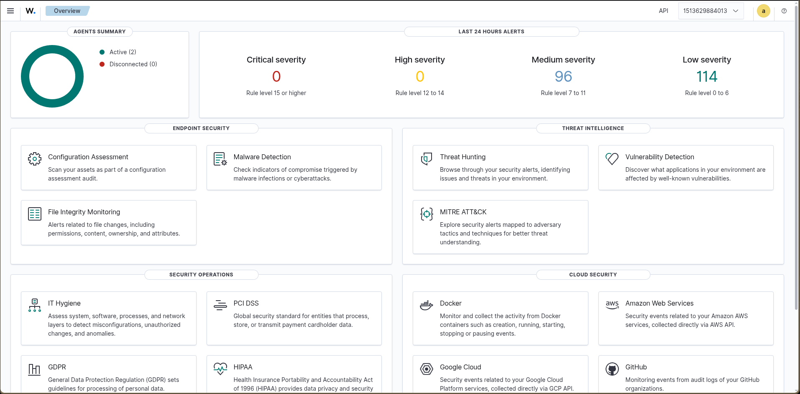
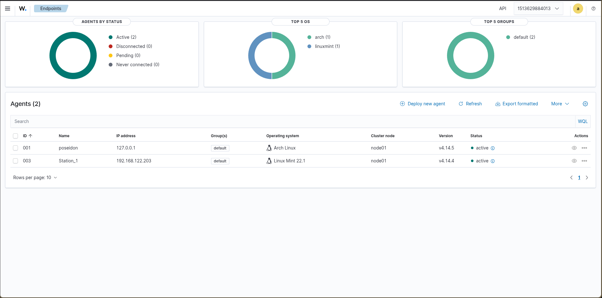
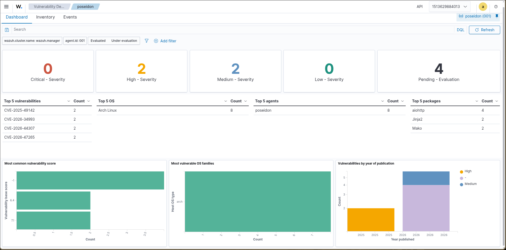
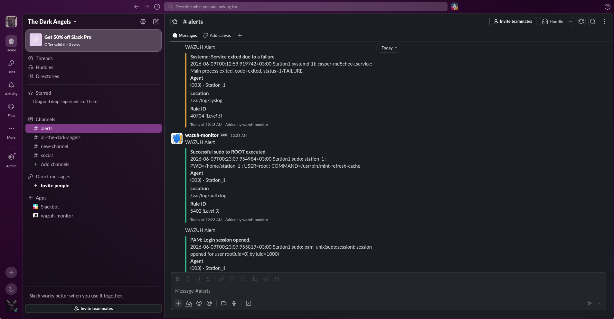

# 🛡️ Project Odesa

A personal blue team home lab built to develop real-world skills in security monitoring, threat detection, and incident analysis.

---

## Overview

Project Odesa is a self-hosted Security Information and Event Management (SIEM) environment running **Wazuh v4.14.4**, deployed via Docker on a dedicated Linux host. The lab simulates a small monitored network with multiple enrolled agents, and real alert generation to mirror the core workflow of a SOC analyst.

This is not a guided tutorial follow-along. Every component was researched, configured, debugged, and documented independently.

---

## Architecture

```
┌─────────────────────────────────────────────┐
│              Poseidon (Manager)              │
│         Arch Linux — Hyprland               │
│         HP EliteBook 745 G6                 │
│         Ryzen 7 PRO 3700U / 16GB RAM        │
│                                             │
│  ┌─────────────────────────────────────┐    │
│  │     Wazuh Stack (Docker)            │    │
│  │  - wazuh-manager                   │    │
│  │  - wazuh-indexer (OpenSearch)       │    │
│  │  - wazuh-dashboard (Kibana)         │    │
│  └─────────────────────────────────────┘    │
│                                             │
│  ┌──────────────┐   ┌─────────────────┐    │
│  │  WireGuard   │   │   KVM/QEMU      │    │
│  │  VPN Server  │   │ Virtualisation  │    │
│  └──────────────┘   └─────────────────┘    │
└─────────────────────────────────────────────┘
          │                     │
          │ WireGuard tunnel     │ virbr0 NAT
          │                     │
┌─────────────────┐   ┌─────────────────────┐
│  Remote Agents  │   │   Linux Mint 22.1   │
│  (Planned)      │   │   VM Agent          │
└─────────────────┘   └─────────────────────┘
```

**Manager:** Poseidon — Arch Linux (Hyprland), HP EliteBook 745 G6, Ryzen 7 PRO 3700U, 16GB RAM

**Agents:**
| Agent | OS | Enrollment Method |
|---|---|---|
| Poseidon (self) | Arch Linux | Native (local) |
| VM-01 | Linux Mint 22.1 | KVM/virbr0 NAT + UFW rules |

---

## Components

### Wazuh SIEM (v4.14.4)
- Deployed via Docker Compose on the host machine
- Wazuh Manager handles agent communication, rule evaluation, and alert generation
- Wazuh Indexer (OpenSearch) stores and indexes all security events
- Wazuh Dashboard provides the web UI for alert review and rule management

### Agent Enrollment
- Agents enrolled using Wazuh agent registration with manager IP and authentication key
- VM agent communicates over KVM's internal NAT bridge (virbr0)
- IP forwarding and UFW rules configured on Poseidon to allow agent traffic on port 1514/1515
- WireGuard VPN configured for future remote agent enrollment

### Slack Alerting
- Wazuh integrated with Slack via webhook
- All alerts forwarded in real-time to a dedicated **#alerts** channel
- Enables instant notification of security events without needing the dashboard open

### WireGuard VPN
- Poseidon configured as WireGuard server
- Static IP assigned, peer configuration documented
- Designed to support remote agent enrollment in future lab expansion

---

## Screenshots

> Screenshots of the live dashboard, enrolled agents, and triggered alerts are in the [`screenshots/`](./screenshots) folder.

## Screenshots

### Dashboard Overview


### Enrolled Agents


### Alert Fired


### Slack Alerts



## Key Skills Demonstrated

- SIEM deployment and administration (Wazuh)
- Docker-based infrastructure management
- Agent enrollment and network configuration (NAT, UFW, IP forwarding)
- Custom detection rule authoring (Wazuh XML rule syntax)
- CVE research and lab-based exploit simulation
- VPN configuration (WireGuard)
- Linux systems administration (Arch Linux, systemd, networking)
- Incident documentation and technical write-ups

---

## Planned Expansions

- [ ] Remote agent enrollment over WireGuard VPN
- [ ] Additional custom rules for MITRE ATT&CK techniques
- [ ] Active response configuration (automated blocking on alert)
- [ ] TryHackMe VM as a dedicated attack simulation agent

---

## Tools & Stack

| Tool | Purpose |
|---|---|
| Slack | Real-time alert notifications via webhook |
| Wazuh v4.14.4 | SIEM — log collection, rule engine, alerting |
| Docker / Docker Compose | Container orchestration |
| OpenSearch | Event indexing and storage |
| KVM / QEMU | Virtual machine management |
| WireGuard | VPN for remote agent connectivity |
| Arch Linux | Host OS (manager) |
| Linux Mint 22.1 | Agent VM OS |

---

## About

Built by **Caxton Baya** — Information Science student at the University of Nairobi, focused on defensive security and blue team operations.

- GitHub: [th3darkangel](https://github.com/th3darkangel)
- Email: bayacaxton@gmail.com

> *"The quieter you become, the more you can hear."*
